# ATIVIDADE — DIAGNÓSTICO DE ESTOQUE COM CONSULTAS SQL
## Disciplina: Banco de Dados
### Professor: Luiz Henrique G. Platini

 

## CONTEXTUALIZAÇÃO

Em qualquer empresa que venda produtos, o estoque é dinheiro parado. Um item caro que fica meses na prateleira representa capital imobilizado: dinheiro que a empresa já gastou e ainda não recuperou. Em lojas de informática o problema é ainda mais sério, porque o produto perde valor enquanto está guardado — o notebook que vale R$ 5.000 hoje valerá R$ 4.000 daqui a oito meses, mesmo lacrado na caixa.

Esses dados já existem dentro do sistema da empresa. O que normalmente falta é alguém capaz de fazer as perguntas certas ao banco de dados e transformar as respostas em informação útil para quem decide. Esse é exatamente o trabalho de quem domina a linguagem SQL.

 

## SITUAÇÃO DESAFIADORA

A I1D35 Informática, loja de médio porte de Americana, encerrou o balanço do semestre e o resultado preocupou a diretoria: o faturamento cresceu, mas o caixa continua apertado. A suspeita do gerente, é de que há dinheiro demais preso em produtos que não giram.

A loja trabalha com 100 itens distribuídos em 10 categorias. O sistema atual só emite a listagem completa em PDF: 100 linhas sem nenhum totalizador, nenhuma média, nenhum ranking. Platini, responsável pelo setor financeiro, passou o fim de semana somando valores na calculadora e desistiu.

Você foi contratado como analista de dados para produzir um Relatório de Diagnóstico de Estoque, baseado exclusivamente em consultas SQL, capaz de sustentar a decisão de compra do próximo mês.

Platini foi direto: "Não me mande a tabela inteira, eu já tenho ela. Me diga quanto dinheiro eu tenho parado, onde ele está parado, e quero saber de onde você tirou cada número."

 

## TAREFA

*PARTE A — CONSULTAS E FILTROS*

1. Liste o nome e o preço de todos os produtos da categoria Monitores.

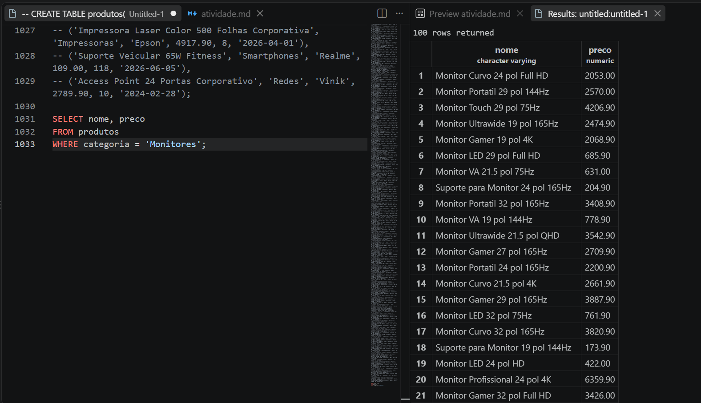

2. Liste todos os produtos com estoque menor que 5 unidades, mostrando nome, categoria e estoque.

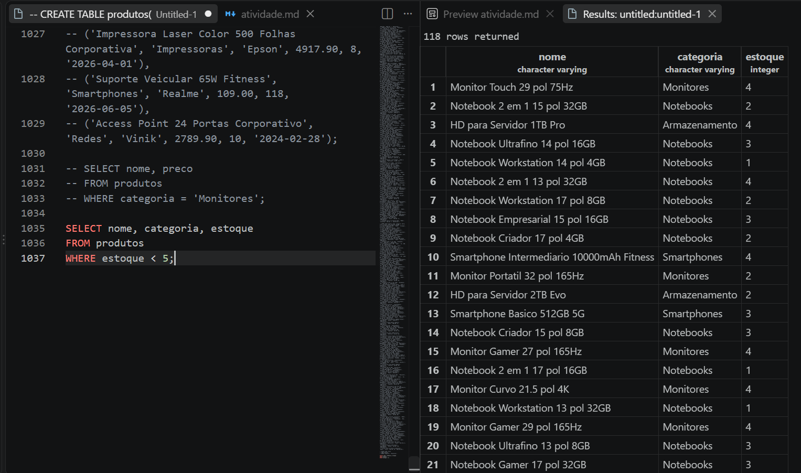

3. Liste os 10 produtos mais caros da loja (nome e preço), do mais caro para o mais barato.

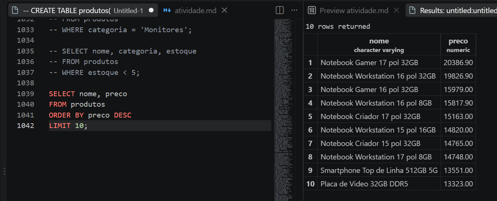

4. Liste os produtos da marca Logitech, ordenados por preço crescente.

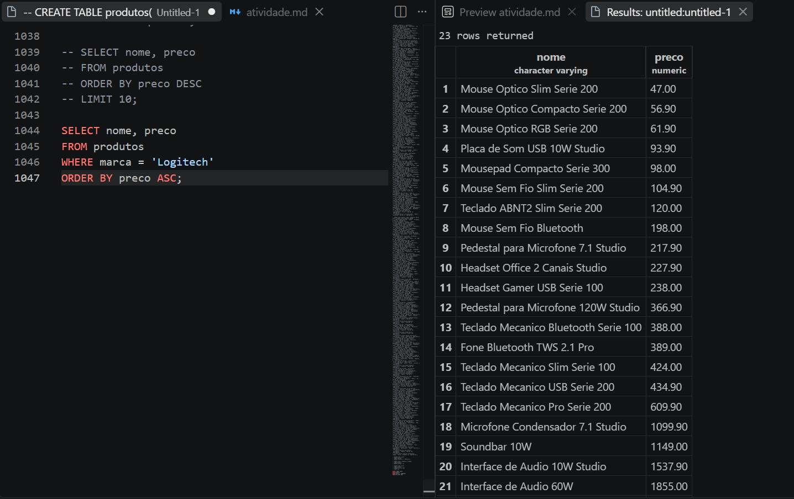

5. Liste os produtos com preço entre R$ 100,00 e R$ 500,00, mostrando nome e preço.

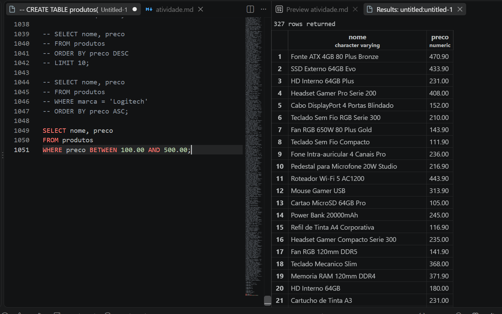

*PARTE B — FUNÇÕES DE AGREGAÇÃO*

1. Quantos produtos existem cadastrados na loja? Dê ao resultado o nome total_de_produtos.

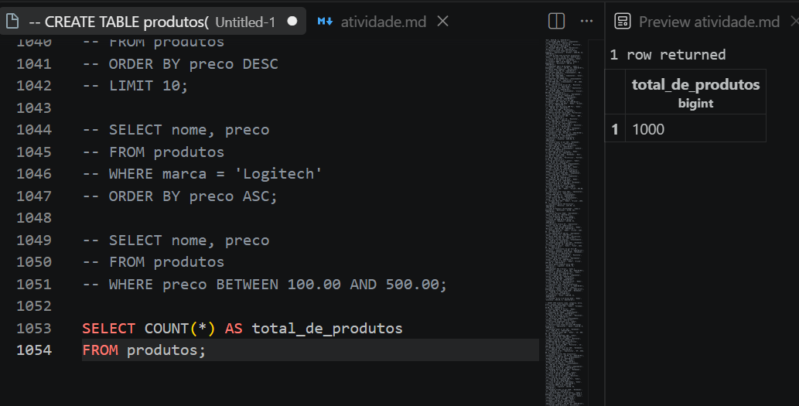

2. Quantos produtos estão com estoque abaixo de 10 unidades? Nomeie a coluna como produtos_em_falta.

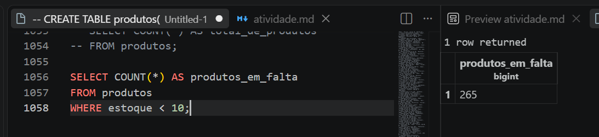

3. Qual o maior e o menor preço da loja? Traga os dois na mesma consulta, com os nomes maior_preco e menor_preco.

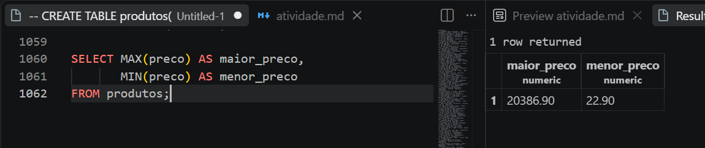

4. Qual o preço médio dos produtos da categoria Notebooks, arredondado para 2 casas decimais?

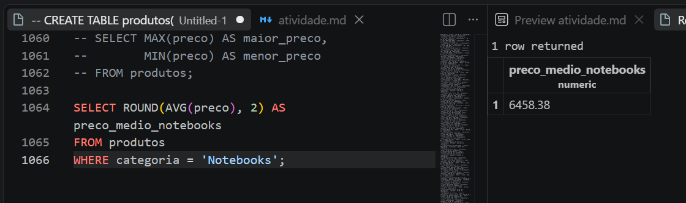

5. Quantas peças a loja tem no total, somando o estoque de todos os produtos? Nomeie como total_de_pecas.

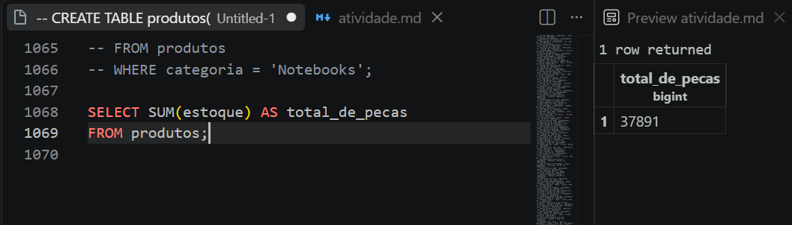

*PARTE C — PAINEL E CÁLCULOS*

1. Monte um painel resumo em uma única consulta, retornando de uma vez: quantidade de produtos, preço médio (2 casas decimais), maior preço, menor preço e total de peças em estoque. Todas as colunas devem ter nomes compreensíveis para o gerente.

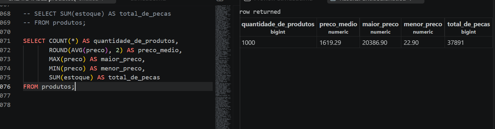

2. O valor imobilizado de um produto não está gravado na tabela: ele precisa ser calculado (preço x estoque). Crie a coluna calculada valor_em_estoque e mostre os 5 produtos com maior valor imobilizado, exibindo nome, preço, estoque e o valor calculado.

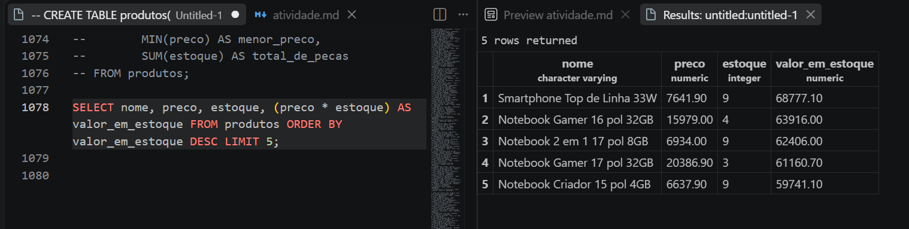

3. Compare o resultado de C2 com o produto mais caro que apareceu em A3. É o mesmo item? Escreva duas linhas explicando o que essa comparação revela sobre o estoque da loja.

Não e o mesmo item, produto mais caro (A3) não é o de maior valor, pois este depende também do estoque. Itens de preço alto com muitas unidades paradas concentram mais capital preso do que os mais caros unitariamente.